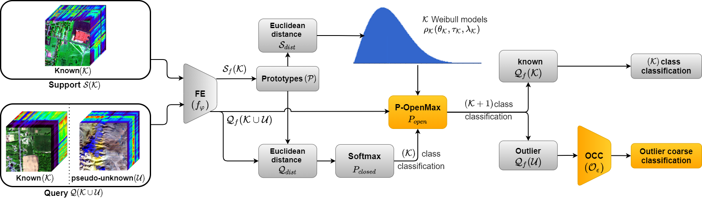
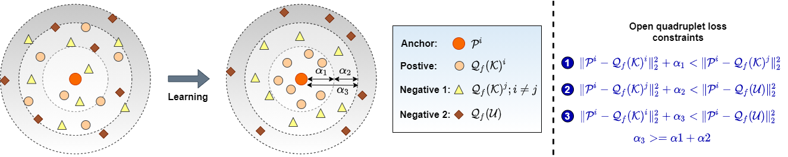

# Extreme Value Meta-Learning for Few-Shot Open-Set Recognition of Hyperspectral Images

The code repository for "Extreme Value Meta-Learning for Few-Shot Open-Set Recognition of Hyperspectral Images" [[paper]](https://ieeexplore.ieee.org/abstract/document/10126083) (TGRS'23) in Tensorflow. 

## Abstract

Recent advancements in prototype-based few-shot open-set recognition (FSOSR) approaches reject outliers based on the high metric distances from the known class prototypes and fail to distinguish spectrally fine-grained land cover outliers. Learning only the Euclidean distance fit spherical distributions ignores the essential distribution parameters such as shift, shape, and scale. The conventional meta-training of FSOSR also ignores the topological consistency of the known classes impacting reduced closed and open accuracy in the meta-testing phase. Moreover, the existing hyperspectral outlier detection methods do not provide intuition about the rejected outlier’s land cover category. To tackle the aforesaid problems, we introduce extreme value meta-learning (EVML), where we fit Weibull distributions per known class based on the limited support-set distances from the respective prototypes. A newly proposed prototypical OpenMax (P-OpenMax) layer leverages these meta-trained Weibull models and calibrates the query distances to reject fine-grained outliers. Then, to learn the topological consistency, we split all the samples in an episode into four parts, including the prototype and its same known class queries, other known class queries, and the remaining known–unknown queries. A novel open quadruplet loss ensures that a prototype’s same-class queries reside closer than the other known-class and known–unknown queries. Finally, we coarse classify the detected outliers into major land cover categories and perform cross-dataset incremental FSOSR to enhance robustness over unknown geographical regions. We validate the efficacy of EVML over four benchmark hyperspectral datasets.

## Open Quadruplet Loss

## Annotation of coarse-grained classes

## Prerequisites

The following packages are required to run the scripts:

- [Tensorflow 2.x](https://www.tensorflow.org/)
- [sklearn 0.21.2](https://scikit-learn.org/stable/)
- [numpy 1.21.6](https://numpy.org/)
- [matplotlib 3.1.1](https://matplotlib.org/)
- [scipy 1.3.0](https://scipy.org/)
- [Opencv 4.1.0](https://pypi.org/project/opencv-python/)
- [libmr 0.1.9](https://pypi.org/project/libmr/)

## Dataset

### Indian Pines, Salinas, Pavia University 
Download from (http://www.ehu.eus/ccwintco/index.php/Hyperspectral_Remote_Sensing_Scenes) 

### Houston-2013
Download from  (https://hyperspectral.ee.uh.edu/?page_id=459)

## Source Code
The codes for meta-training, fine-tuning and meta-testing on Indian Pines dataset are available in src folder with name as "EVML_IP_5shot.ipynb". The code is configured for 5-way 5-shot recognition. 

## Citation  
If you use any content of this repo for your work, please cite the following bib entry:

	@ARTICLE{10126083,
    author    = {Pal, Debabrata and Bose, Shirsha and Banerjee, Biplab and Jeppu, Yogananda},
    journal   = {IEEE Transactions on Geoscience and Remote Sensing},
    title     = {Extreme Value Meta-Learning for Few-Shot Open-Set Recognition of Hyperspectral Images},
    year      = {2023},
    volume    = {61},
    number    = {},
    pages     = {1-16},
    doi       = {10.1109/TGRS.2023.3276952}
	}

## Licence
EVML is released under the MIT license.

Copyright (c) 2023 Debabrata Pal. All rights reserved.
